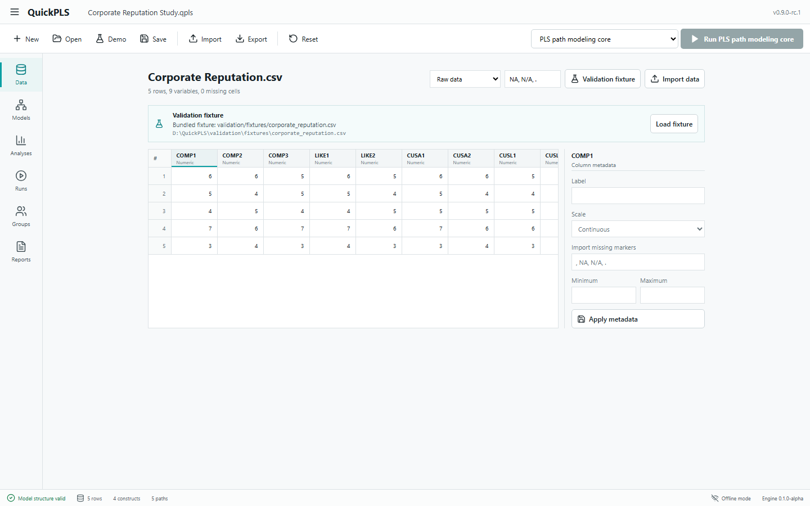
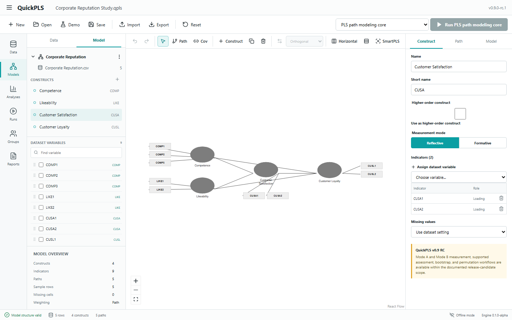
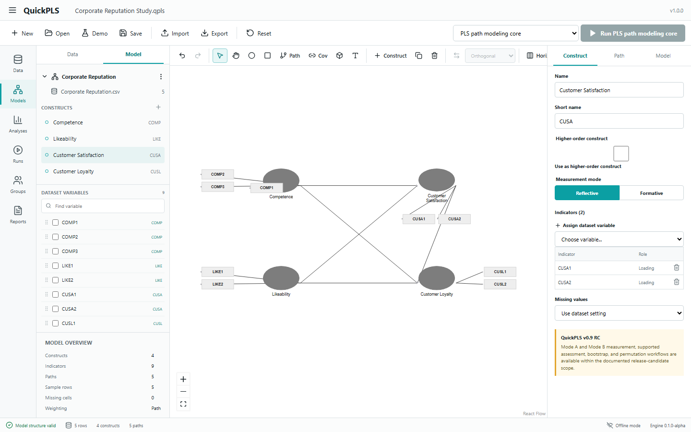
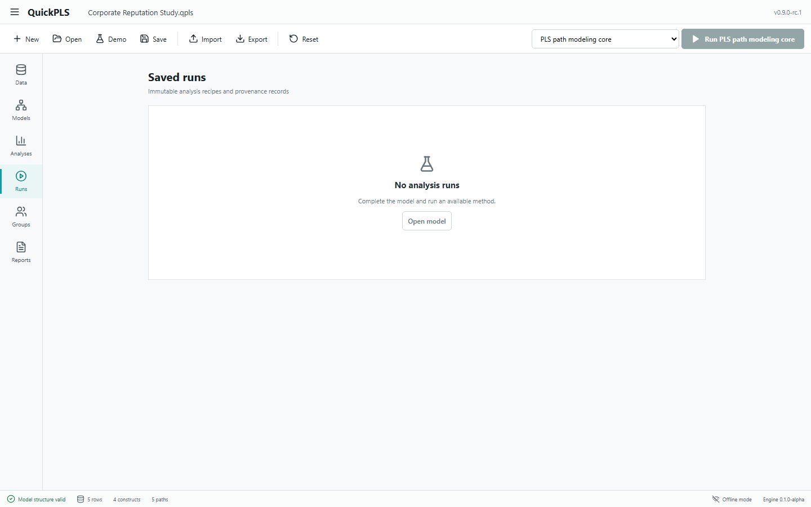
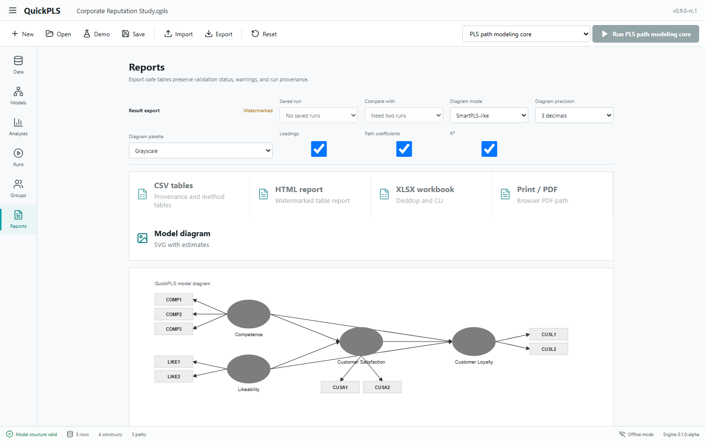
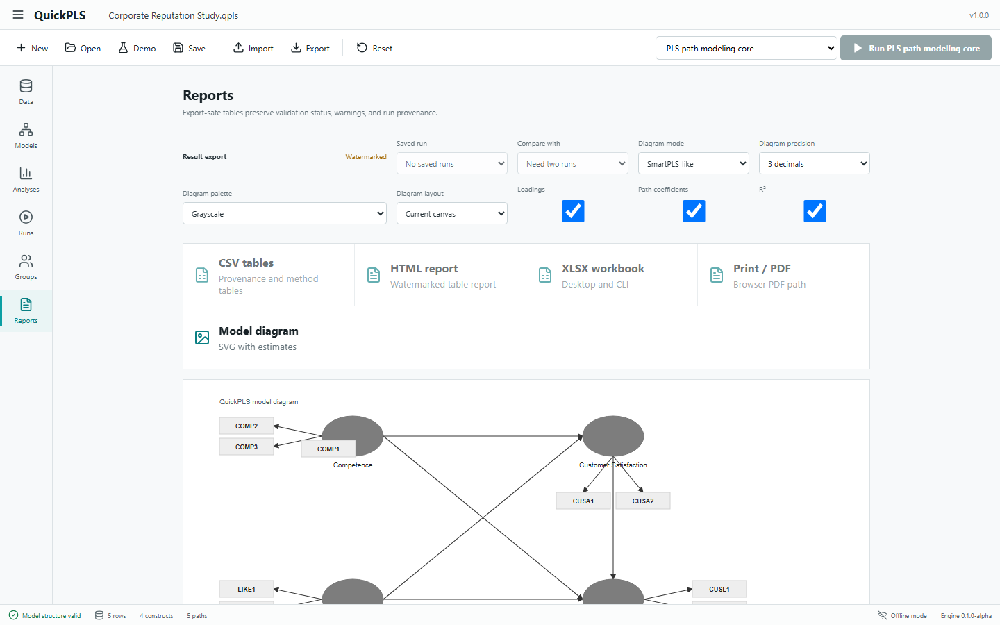

# QuickPLS

QuickPLS is a free, proprietary, fully offline Windows desktop application for researchers working with structural equation modeling and related quantitative methods.

Version `1.0.0` is stable for the documented supported scope. It does not require an account, activation server, telemetry, cloud storage, R, Python, or any remote computation at runtime.

> QuickPLS is independently implemented from published methods and permitted documentation. It does not import SmartPLS project files, does not reverse-engineer SmartPLS, and does not claim identical results for undocumented SmartPLS behavior.

## Download

Use the GitHub Release for `v1.0.0` and download one of:

- `QuickPLS_1.0.0_x64-setup.exe` - Windows installer.
- `quickpls-desktop.exe` - portable Windows executable.

Current local release artifacts after building this repository:

```text
target/release/bundle/nsis/QuickPLS_1.0.0_x64-setup.exe
target/release/quickpls-desktop.exe
```

The installer is currently unsigned. Windows SmartScreen may show a warning. This is expected until a code-signing certificate is supplied and audited.

## Screenshots

### Data Workspace



### Professional SEM Designer



### Dragging Indicators And Layout Editing



### Saved Runs



### Reports



### Publication Diagram



## What Is Stable In v1.0.0

QuickPLS v1.0.0 is stable only for the bounded scope documented in:

- [Supported Scope](docs/V1_SUPPORTED_SCOPE.md)
- [Compatibility Matrix](docs/V1_COMPATIBILITY_MATRIX.md)
- [Known Differences](docs/V1_KNOWN_DIFFERENCES.md)
- [Methodology Manual](docs/METHODOLOGY_MANUAL_V1_0.md)
- [Validation Artifact Index](docs/VALIDATION_ARTIFACT_INDEX_V1_0.md)

High-level supported areas include:

- Offline Windows project workspace.
- CSV, TSV, XLSX, SAV, covariance, and correlation import coverage where documented.
- `.qpls` project archives, saved recipes, saved runs, autosave, recovery, and migration checks.
- Professional academic SEM diagram designer with persistent layout metadata.
- PLS-SEM core, assessment, inference, extended PLS, prediction/heterogeneity, bounded CB-SEM/CFA ML, bounded GSCA, PCA, regression/PROCESS, and NCA for audited method shapes.
- CSV, HTML, XLSX, and SVG publication diagram export surfaces.
- Browser print-to-PDF workflow from reports.

## Important Limits

These are not part of v1.0.0:

- SmartPLS project import.
- Guaranteed identity with SmartPLS outputs.
- Reproduction of undocumented SmartPLS behavior.
- Native CLI PDF/PNG export.
- Ordinal/polychoric/WLSMV/FIML CB-SEM.
- Signed installer.
- Runtime dependency on R, Rscript, Python, lavaan, cSEM, seminr, plspm, NumPy, or validation tooling.

## Quick Start

See [Quick Start](docs/QUICK_START_V1_0.md).

Short version:

1. Download `QuickPLS_1.0.0_x64-setup.exe` from the GitHub Release.
2. Install and launch QuickPLS.
3. Import a CSV/XLSX/SAV dataset.
4. Drag variables into the SEM designer to create constructs and indicators.
5. Draw structural paths.
6. Click `Run`.
7. Select the saved run to show estimates on the diagram.
8. Export tables and publication SVG from Reports.

## Build From Source

QuickPLS source is available for inspection and contribution under the proprietary license in [LICENSE.md](LICENSE.md). It is not open-source software.

Prerequisites:

- Windows
- Node.js/npm
- Rust toolchain
- Tauri build prerequisites

Commands:

```powershell
npm install
npm run build
cargo test -p qpls-core
npm run tauri -- build
```

Development desktop run:

```powershell
npm run tauri dev
```

The browser page at `http://127.0.0.1:1420` is only a frontend preview. Native file dialogs, project storage, and engine jobs require the Tauri desktop app.

## Verify v1.0.0

Core release verification:

```powershell
npm test -- --run
npm run build
npm run qpls:publication:all
npm run qpls:v093:sem-designer
npm run tauri -- build
npm run qpls:v10:audit
cargo run -p qpls-cli -- gate v1_0_stable
```

Expected final gate:

```text
Stable all-method release (v1.0) | Validated | gates passed/open/blocked: 8/0/0
promotion gate: clear
```

## Release Files And Checksums

See [v1.0 checksums](docs/RELEASE_CHECKSUMS_V1_0.txt).

## Documentation

- [Installation](docs/INSTALLATION_V1_0.md)
- [Quick Start](docs/QUICK_START_V1_0.md)
- [User Guide](docs/USER_GUIDE_V1_0.md)
- [First PLS Model Tutorial](docs/FIRST_PLS_MODEL_TUTORIAL.md)
- [Troubleshooting](docs/TROUBLESHOOTING.md)
- [FAQ](docs/FAQ.md)
- [Release Notes](docs/RELEASE_NOTES_V1_0.md)
- [Dependency Notices](docs/DEPENDENCY_NOTICES_V1_0.md)

## License

QuickPLS is free to use but proprietary. See [LICENSE.md](LICENSE.md) and [EULA.md](EULA.md).

Unless a separate written agreement says otherwise, you may use QuickPLS as an end user, inspect the source in this repository, and submit issues or proposed changes, but you may not sell, sublicense, redistribute modified builds, remove notices, or present derived software as QuickPLS.

## Security

Please report security issues using [SECURITY.md](SECURITY.md). Do not disclose suspected vulnerabilities publicly before they are reviewed.

