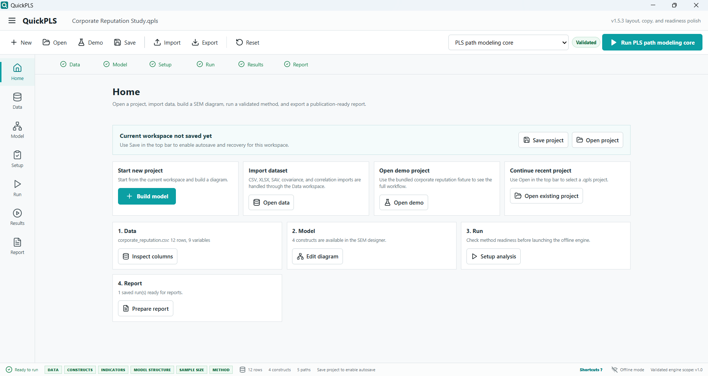
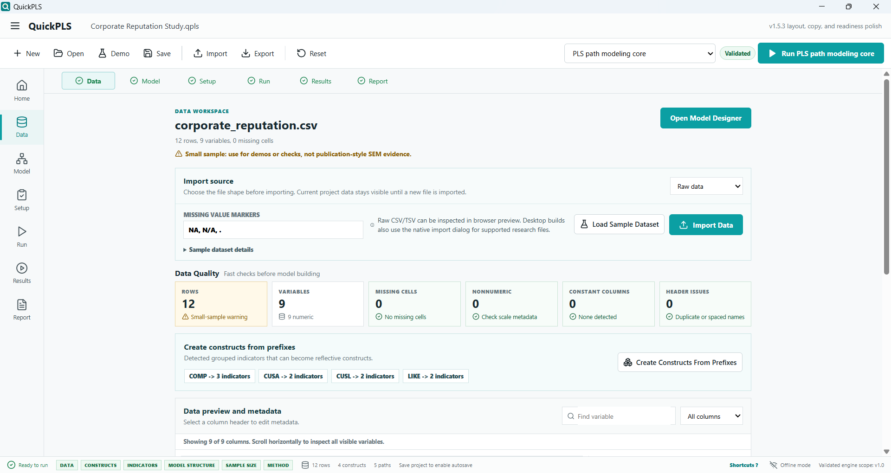
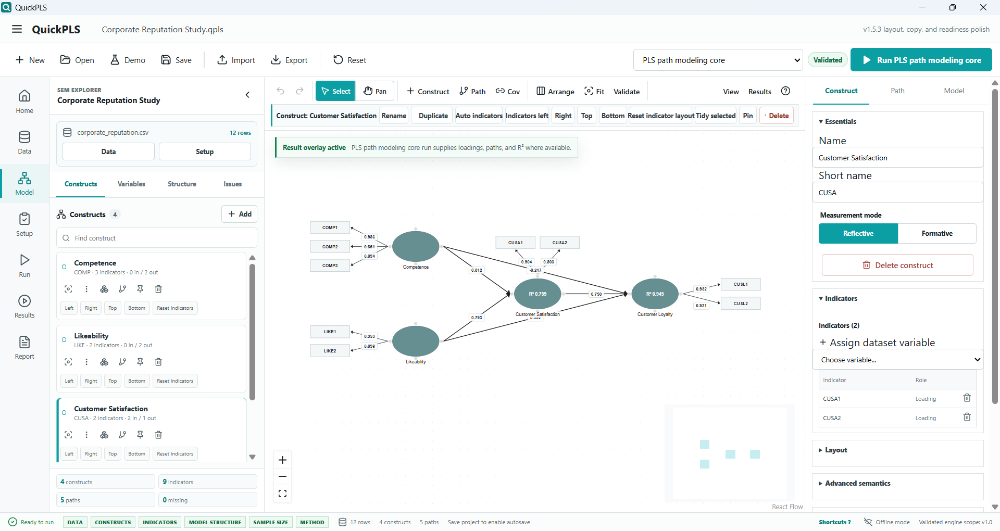
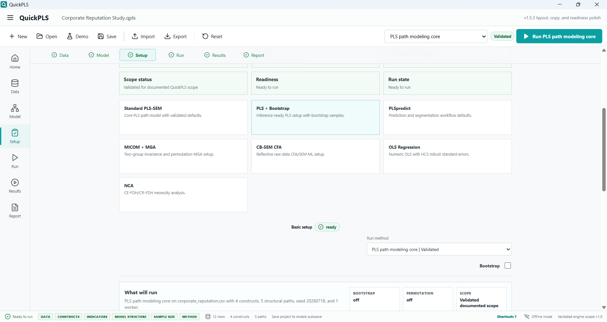
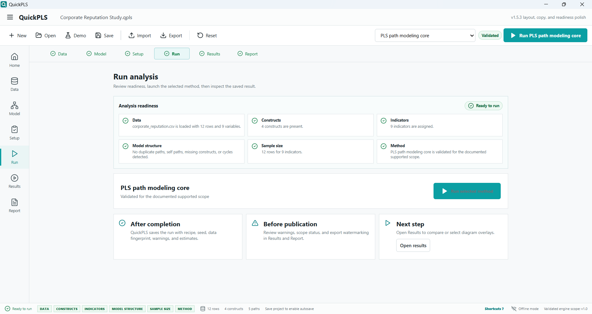
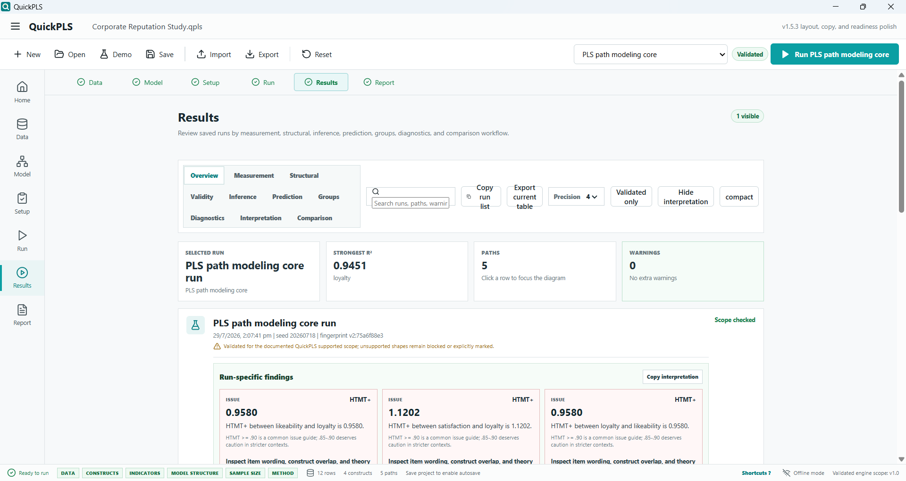
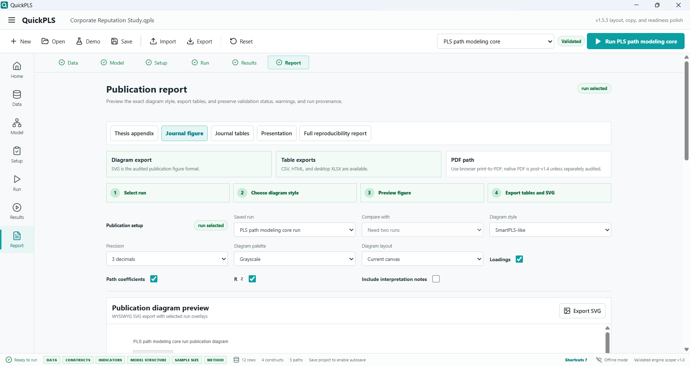
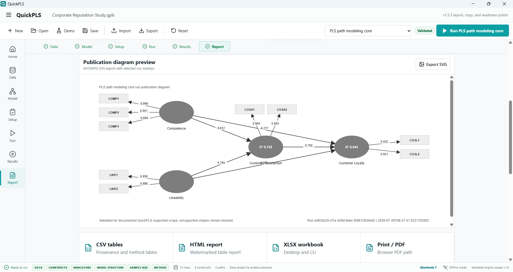

# QuickPLS

QuickPLS is a free, proprietary, fully offline Windows desktop application for researchers working with PLS-SEM, SEM diagrams, validated method workflows, results interpretation, and publication-ready exports.

Current release: `v1.8.1`.

QuickPLS runs locally. It does not require an account, activation server, telemetry, cloud storage, R, Python, or remote computation at runtime.

> QuickPLS is independently implemented from published methods and permitted documentation. It does not import SmartPLS project files, does not reverse-engineer SmartPLS, and does not claim identical results for undocumented SmartPLS behavior.

## Download

Use the GitHub Release for `v1.8.1` and download one of these Windows assets:

- `QuickPLS_1.8.1_v1_8_1_method_applicability_guided_setup_20260729-140437_x64_setup.exe` - installer.
- `QuickPLS_1.8.1_v1_8_1_method_applicability_guided_setup_20260729-140437_x64_portable.exe` - portable executable.
- `QuickPLS_1.8.1_v1_8_1_method_applicability_guided_setup_20260729-140437_x64_checksums.txt` - SHA-256 hashes.

The installer is currently unsigned. Windows SmartScreen may show a warning until code signing is added and audited.

## Screenshots

### Home



### Data Workspace



### Professional SEM Designer



### Guided Method Setup



### Run Workspace



### Results



### Reports



### Publication Diagram



## What Users Can Do

- Import CSV, TSV, XLSX, SAV, covariance, and correlation data where documented.
- Inspect data quality, missing values, column metadata, and prefix-based construct suggestions.
- Build SEM diagrams with latent constructs, indicators, paths, covariances, layout controls, and result overlays.
- Use Setup guidance to see which methods are recommended, available after setup, not applicable, unsupported, or experimental for the current dataset and model.
- Run validated method scopes through the offline desktop engine.
- Review results with tables, interpretation findings, reportability guidance, warnings, and provenance.
- Export publication SVG diagrams plus CSV, HTML, and XLSX tables.
- Build a reviewer/reproducibility package from documented report exports.

## Current Scope

QuickPLS is validated only for documented scopes. The UI marks methods and shapes as `Validated scope`, `Experimental`, `Unsupported`, or `Not applicable` based on the current dataset, model, and settings.

Primary documentation:

- [Method Compatibility](docs/METHOD_COMPATIBILITY.md)
- [Supported v1 Scope](docs/V1_SUPPORTED_SCOPE.md)
- [Known Differences](docs/V1_KNOWN_DIFFERENCES.md)
- [Methodology Manual](docs/METHODOLOGY_MANUAL_V1_0.md)
- [Validation Artifact Index](docs/VALIDATION_ARTIFACT_INDEX_V1_0.md)
- [v1.8.1 Method Applicability Guide](docs/V1_8_1_METHOD_APPLICABILITY_GUIDED_SETUP.md)

Important limits:

- No SmartPLS project import.
- No guaranteed identity with SmartPLS outputs.
- No reproduction of undocumented SmartPLS behavior.
- No runtime dependency on R, Rscript, Python, lavaan, cSEM, seminr, plspm, NumPy, or validation tooling.
- Native PDF/PNG export is not promoted; use SVG and browser print-to-PDF where documented.
- Installer signing is still pending.

## Quick Start

See [Quick Start](docs/QUICK_START.md).

Short version:

1. Install QuickPLS or launch the portable executable.
2. Open the demo project or import your dataset in `Data`.
3. Create constructs from prefixes or build a model manually in `Model`.
4. Use `Setup` to choose a recommended method and complete required settings.
5. Click `Run`.
6. Review `Results`, including warnings, scope status, and interpretation notes.
7. Use `Report` to export SVG diagrams and result tables.

## Build From Source

QuickPLS source is available for inspection and contribution under the proprietary license in [LICENSE.md](LICENSE.md). It is not open-source software.

See [Build From Source](docs/BUILD_FROM_SOURCE.md).

Basic commands:

```powershell
npm install
npm test -- --run
npm run build
cargo test -p qpls-core -p qpls-project -p qpls-runner -p quickpls-desktop
npm run qpls:desktop:build-versioned
```

Versioned release artifacts are written to:

```text
target/release/artifacts/
```

## Verify v1.8.1

```powershell
npm test -- --run
npm run build
npm run qpls:v18:results-report-refinement
npm run qpls:v181:method-applicability
cargo test -p qpls-core -p qpls-project -p qpls-runner -p quickpls-desktop
cargo run -p qpls-cli -- gate v1_8_1_method_applicability_guided_setup
```

Expected v1.8.1 gate:

```text
v1_8_1_method_applicability_guided_setup
gates passed/open/blocked: all passed / 0 open / 0 blocked
promotion gate: clear
```

## Release Files And Checksums

See [v1.8.1 checksums](docs/RELEASE_CHECKSUMS_V1_8_1.txt).

Release creation notes are in [GitHub Release v1.8.1](docs/GITHUB_RELEASE_V1_8_1.md).

## Documentation

- [Installation](docs/INSTALLATION.md)
- [Quick Start](docs/QUICK_START.md)
- [User Guide](docs/USER_GUIDE.md)
- [Build From Source](docs/BUILD_FROM_SOURCE.md)
- [First PLS Model Tutorial](docs/FIRST_PLS_MODEL_TUTORIAL.md)
- [Troubleshooting](docs/TROUBLESHOOTING.md)
- [FAQ](docs/FAQ.md)
- [Release Notes v1.8.1](docs/RELEASE_NOTES_V1_8_1.md)
- [Dependency Notices](docs/DEPENDENCY_NOTICES.md)

## License

QuickPLS is free to use but proprietary. See [LICENSE.md](LICENSE.md) and [EULA.md](EULA.md).

Unless a separate written agreement says otherwise, you may use QuickPLS as an end user, inspect the source in this repository, and submit issues or proposed changes, but you may not sell, sublicense, redistribute modified builds, remove notices, or present derived software as QuickPLS.

## Security

Please report security issues using [SECURITY.md](SECURITY.md). Do not disclose suspected vulnerabilities publicly before they are reviewed.
