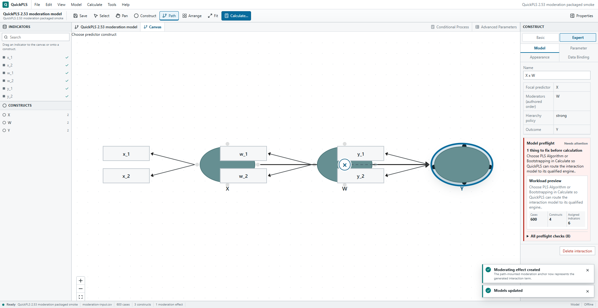

# QuickPLS vs SmartPLS SEM Designer

## Comparative analysis and recommended QuickPLS canvas direction

**Assessment date:** 2026-08-21

**QuickPLS baseline:** 2.53 source and current packaged evidence

**SmartPLS baseline:** 4.1.1.8, the current version listed by SmartPLS on the assessment date

## Executive conclusion

QuickPLS is much closer to SmartPLS in scientific modeling capability than its current Canvas experience suggests. Its principal competitive weakness is not the absence of mediation, moderation, higher-order constructs, persistence, or result overlays. The weakness is that common diagram operations are less direct, less visible, or no longer exposed in the current native shell.

The most important finding is that several apparent gaps are already implemented below the UI:

- construct indicator placement on the left, right, top, or bottom;
- per-indicator free positioning and reset;
- alignment and distribution of selected constructs;
- duplicate and pin metadata;
- wide path hit areas;
- two-way and three-way moderation authorities;
- visual-only moderation anchors and connectors;
- draggable path labels and multiple routing styles;
- result-to-diagram highlighting.

Some of these controls existed in an older QuickPLS interface but are not connected to the current native Properties pane or command system. Restoring them coherently is lower risk and more valuable than building another advanced workspace.

SmartPLS feels easier because it uses one consistent modeling grammar:

1. Select an object.
2. Act directly on that object or draw a relationship from it.
3. Treat relationships as selectable and drawable targets.
4. Keep frequent actions in the context-sensitive toolbar or context menu.
5. Open a detail dialog only when a scientific choice is actually required.
6. Reuse the same diagram when presenting results.

QuickPLS should adopt that grammar independently, without cloning SmartPLS's appearance or internal design.

The recommended primary grammar is:

- drag selected indicators to empty Canvas → create a construct;
- drag selected indicators to a construct → assign them;
- connect construct to construct → create a structural path;
- connect construct to path → create two-way moderation;
- connect construct to a moderation anchor → create three-way moderation;
- select construct → set indicator position;
- multi-select constructs → align or distribute;
- use Arrange only for intentional whole-model layout;
- click selects, Enter or double-click edits, Delete removes, Escape cancels.

## Evidence and limits

This report uses three kinds of evidence:

- **SmartPLS documented:** current official SmartPLS documentation, official interface screenshots, and official release notes.
- **QuickPLS confirmed:** current QuickPLS source and existing automated screenshots.
- **Recommendation:** an independent design decision based on both products and standard desktop-editor practice.

SmartPLS was not operated through a licensed live session for this assessment. Therefore, exact gestures are described as confirmed only when they appear in official text or official screenshots. The public screenshots are official interface evidence, but SmartPLS does not date every screenshot to its latest minor release.

Official sources:

- [SmartPLS downloads and current version](https://www.smartpls.com/downloads/)
- [SmartPLS release notes](https://www.smartpls.com/release_notes/)
- [Your first PLS path model](https://www.smartpls.com/documentation/tutorials/first-pls-path-model/)
- [Create your first project and UI structure](https://www.smartpls.com/documentation/tutorials/first-project/)
- [SmartPLS moderation](https://www.smartpls.com/documentation/algorithms-and-techniques/extended-relationships/moderation/)
- [SmartPLS CB-SEM moderation](https://www.smartpls.com/documentation/algorithms-and-techniques/cbsem-moderation/)
- [SmartPLS mediation](https://www.smartpls.com/documentation/algorithms-and-techniques/extended-relationships/mediation/)
- [SmartPLS higher-order models](https://www.smartpls.com/documentation/algorithms-and-techniques/extended-relationships/higher-order/)
- [SmartPLS model comments](https://www.smartpls.com/faq/smartpls4/commenting-models)

## Important terminology correction

The four directional controls observed in SmartPLS are best understood as **indicator position**, not the scientific direction of a latent variable.

These are separate concepts:

| Concept | Meaning | Scientific impact |
|---|---|---|
| Indicator position | Place indicators left, right, above, or below the construct | Presentation only |
| Measurement model | Reflective or formative measurement direction | Changes the scientific model |
| Structural path direction | Predictor → outcome | Changes the scientific model |

SmartPLS documents indicator alignment separately from **Invert measurement model**. QuickPLS should use the unambiguous labels **Indicator position** and **Measurement model**, never one generic command named Direction.

## Current QuickPLS visual baseline

### Ordinary Canvas

The native shell is compact and professional, with Indicators and Constructs on the left, Canvas in the center, and selection-aware Properties on the right. The primary concern is that elementary diagram operations are absent from the visible selection controls while advanced preparation commands occupy permanent space above the Canvas.

### Large model

The Canvas can render a 20-construct, 80-indicator model, but Fit makes labels too small for practical reading. This is now a navigation and semantic-zoom problem, not a rendering-capacity problem.

### Moderation

The scientific presentation is already strong: the focal path stays solid, the moderator connector is dashed, the effect has a compact `×` anchor, generated interaction constructs are hidden, and the anchor is selection-aware. The remaining weakness is how users initiate and manipulate the effect.

## Overall comparison

| Area | SmartPLS | QuickPLS 2.53 | Competitive assessment |
|---|---|---|---|
| Workspace structure | Indicators/navigation left, Canvas center, contextual tools right | Same basic three-pane desktop pattern | Broad parity |
| Create construct | Drag one or several indicators to Canvas; name and press Enter | Drag/click individual indicator or double-click Canvas | Functional, but batch workflow is weaker |
| Assign indicators | Direct drag to construct, including multi-indicator workflows | Navigator and Canvas assignment exist, but current navigator acts one variable at a time | Material efficiency gap |
| Indicator position | Selected construct exposes alignment around top/right/bottom/left | Store supports all sides and free placement; current native UI does not expose them | High-value hidden capability |
| Reflective/formative | Context command to invert measurement model | Properties → Parameter controls | Correct, but slower |
| Draw path | Connect source to target | Path tool, two-click flow, and connection handles | Broad parity |
| Reverse path | Conventional edit | Dedicated Reverse action | QuickPLS advantage |
| Path targetability | Relationship is directly addressable | Path has a 26-pixel invisible interaction width and is selectable | Technical parity, gesture gap |
| Two-way moderation | Draw moderator relationship directly to focal path | Drag the whole construct over a path, or select path and use `M`/menu/dialog | Functional but less natural |
| Three-way moderation | Draw another moderator to existing interaction offset | Select existing anchor and press `M` or use contextual command | Functional but indirect |
| Moderation diagram | Dashed connector and path anchor | Dashed connector and visual-only `×`/`3×` anchor | Strong parity; QuickPLS authority is safer |
| Mediation | Derived from ordinary structural paths | Derived from substantive directed paths with technical exclusions | Strong parity |
| HOC | Largely diagram/manual repeated/two-stage workflows | Compact guided create/edit dialog plus visual membership overlay | QuickPLS can be superior |
| Selection | Direct object selection and contextual tools | Click, marquee and Ctrl multiselect | Broad parity |
| Align selected | Toolbar/context alignment | Store implements six align operations, but native shell does not expose them | Hidden capability |
| Distribute selected | Diagram editing support is visible in the editor family; exact current command not confirmed publicly | Store implements horizontal/vertical distribution, but native shell does not expose it | QuickPLS opportunity |
| Snap assistance | Positioning helper/alignment tools | 10-pixel grid plus live edge/center guides | QuickPLS strength |
| Whole-model arrange | No definitive current official general auto-layout evidence found | Prominent Arrange command | QuickPLS strength, presently too coarse |
| Pin layout | Not established in public evidence | Metadata exists, but Arrange clears pin state | Do not re-expose until corrected |
| Path routing | Editable corners/vertices and line decoration | Straight, curved, orthogonal/polyline data and label movement; no visible bend handles | Partial parity |
| Label placement | Movable construct/connection labels and reset | Path labels can be dragged, keyboard nudged, and reset | Strong path-label support |
| Styling | Shapes, colors, borders, line styles, decorations, label positioning | More restrained scientific styling; presentation objects only under strict authority | SmartPLS richer |
| Notes | Markdown and images | Caption/note/shape/line layer; image remains an asset placeholder | Material polish gap |
| Undo/redo | Present | Ctrl+Z/Ctrl+Y and bounded history | Parity |
| Duplicate/copy | Whole model resources can be duplicated; selected-object clipboard parity is not publicly confirmed | Unreachable limited duplicate helper; no native graph copy/paste commands | QuickPLS gap |
| Zoom/pan | Wheel zoom, Ctrl/Cmd-drag, restored zoom | Pan, wheel/controls, 25–220%, Fit | Broad parity |
| Minimap/overview | Not established in official public evidence | No minimap | Optional improvement, not parity requirement |
| Large-model navigation | Mature editor and report navigation | Rendering works, but Fit over-shrinks and relationships lack a navigator | Material usability gap |
| Results diagram | Graphical result selectors, path emphasis, report navigation | Canonical result overlays for paths, mediation, moderation and HOC | Strong foundation; presentation depth can improve |
| Keyboard alternatives | Some documented shortcuts; full keyboard graph accessibility not established | V/H/C/P/M/F, Enter/F2, Delete, undo/redo, Shift+F10 | QuickPLS strength |
| Scientific/presentation separation | User-facing behavior is convenient, internals not assessed | Visual moderation/HOC projections explicitly excluded from scientific edges and identities | QuickPLS architectural strength |

## Why SmartPLS currently feels faster

The difference is mostly interaction cost.

| Research task | SmartPLS-style primary flow | QuickPLS current primary flow | Finding |
|---|---|---|---|
| Build one construct from five indicators | Select five → drag once → name | Repeat individual indicator actions or create then assign repeatedly | Too much repetition |
| Move all indicators above construct | Select construct → choose indicator alignment | No current native command; move individually or accept automatic layout | Major discoverability gap |
| Change to formative | Right-click → Invert measurement model | Select → Parameter tab → choose mode | Scientifically sound, slower |
| Add moderation W on X→Y | Draw W to path | Move whole W node onto path, or select path → `M`/menu → dialog | Wrong primary mental model |
| Extend to three-way moderation | Draw Z to interaction anchor | Select anchor → `M` → choose Z → confirm | More indirect |
| Align a row of constructs | Multi-select → alignment action | Move manually or Arrange the whole model | Local-control gap |
| Repair a crowded area | Select region → align/distribute | Whole-model Arrange may disturb unrelated work | Coarse operation |
| Find a path in a dense model | Direct diagram interaction/report tools | Pixel target or Canvas traversal | Relationships navigator needed |

These counts describe primary user actions, not measured timing. They show why experienced SmartPLS users perceive QuickPLS as more complicated even when the scientific endpoint exists.

## Detailed findings

### 1. Indicator placement is implemented but stranded

QuickPLS already defines indicator sides `left`, `right`, `top`, `bottom`, and `free`, including per-indicator layout, ordering, pinning, and reset. Automatic topology-aware placement is also active. The current native Properties pane exposes only construct coordinates under Appearance, not indicator placement.

The older, non-production QuickPLS interface still contains buttons for left/right/top/bottom and reset. This establishes that the gap is primarily integration and presentation, not data-model work.

Recommended design:

- In Properties → Appearance, add a compact **Indicator position** control with Automatic, Left, Right, Above, and Below.
- Add the same commands under the construct context menu.
- Keep **Free placement** available in Expert mode or by dragging an individual indicator.
- Preserve manual overrides across Arrange and reopen.
- Treat this as one undoable presentation change, never a scientific revision.

Do not add four permanent toolbar buttons. They would be meaningless without a selected construct and would increase Canvas clutter.

### 2. QuickPLS moderation is scientifically good but initiated with the wrong gesture

QuickPLS already supports three routes:

- move an entire eligible moderator construct over a focal path;
- select/right-click the focal path and choose Add Moderating Effect;
- select the focal path and press `M`.

The path already has a generous invisible hit area, highlights as a candidate, and displays a drop message. On creation, the construct is restored to its original location and a setup dialog opens.

This works, but moving a node is normally understood as layout editing. Using the same gesture to create a scientific relationship is surprising and can be triggered while merely rearranging a model.

SmartPLS uses the clearer grammar: draw a relationship from the moderator construct to the focal relationship. For multi-way moderation, draw another moderator to the existing interaction offset.

Recommended QuickPLS behavior:

1. Use the existing Connect mode and source handles.
2. Starting on a construct creates a ghost connector.
3. Eligible constructs, paths, and moderation anchors become explicit targets.
4. Construct → construct creates a structural path.
5. Construct → path creates two-way moderation.
6. Construct → `×` anchor creates three-way moderation.
7. Hover shows `Create moderation: Gender moderates Motivation → Performance`.
8. Invalid targets show one reason and make no mutation.
9. If there is no scientific choice, create directly and offer Undo.
10. Open the dialog only for a genuine choice, blocked model, or Save As Revision requirement.

Keep `M`, Model menu, context menu, and dialog flows. They are important keyboard and precision alternatives. The whole-node drop can remain temporarily as a shortcut, but it should not be taught as the primary workflow.

### 3. Multi-indicator workflows need Windows-native selection

The Canvas drop receiver can already accept multiple variables. The current native Indicators navigator serializes one variable at a time, so the underlying batch capability is not reachable through the normal shell.

Recommended behavior:

- single click selects an indicator without changing the model;
- Ctrl-click toggles selection;
- Shift-click selects a range;
- drag ghost shows count and a short name preview;
- drop on empty Canvas creates one construct;
- drop on a construct assigns all selected indicators;
- Enter or context menu offers Create Construct and Assign to Selected Construct;
- a normal selection click must not silently mutate the model.

This is a major task-time improvement and mostly an exposure change.

### 4. Local alignment and distribution should replace overuse of Arrange

QuickPLS has strong live snap guides and store operations for:

- align left, center, right;
- align top, middle, bottom;
- distribute horizontally and vertically.

The native command registry does not expose them. Users must manually drag or run a whole-model Arrange operation. Arrange is valuable, but it is too destructive for polishing one region of an established model.

Recommended **Arrange ▾** menu:

- Tidy selection
- Align left / center / right
- Align top / middle / bottom
- Distribute horizontally / vertically
- Arrange model left-to-right
- Arrange model top-to-bottom

Each command should be one undoable presentation transaction. Whole-model layout must preserve pinned constructs, manually chosen indicator sides, label offsets, moderation anchor placement, and annotation positions. The current pin behavior should be fixed before Pin is returned to the UI.

### 5. The Properties pane should become fully selection-aware

Current Properties coverage is scientifically substantial, but basic diagram editing is thin.

Recommended selection views:

| Selected object | Frequent controls |
|---|---|
| Construct | Name, measurement model, indicator position, indicators, position, pin |
| Structural path | Role, reverse, routing, label position, delete |
| Moderation | Focal relationship, moderator(s), edit, anchor position, delete |
| HOC | Type, approach, components, edit |
| Indicator | Assignment, order, side/free position, reset |
| Multi-selection | Align, distribute, tidy selection, delete |
| Annotation | Text/asset, size, style, order, delete |

Common operations should also appear in context menus. Properties should not become a long tutorial or permanent validation dashboard.

### 6. Strict-authority direct edits contain two important seams

Current navigator assignment correctly routes through strict scientific intents. However, direct indicator drop onto a latent node and inline node rename still call legacy store actions that return unchanged for strict-authority models.

Consequences:

- users can perform an apparently valid direct action and see no model change;
- the same operation behaves differently depending on where it is initiated;
- a SmartPLS-experienced user will interpret this as a broken Canvas.

The direct Canvas gesture, context action, and Properties edit must all route through one authority-aware command. No visible interaction should silently no-op.

### 7. Large-model navigation needs semantic focus, not only Fit

QuickPLS renders large models efficiently, but fitting all 20 constructs and 80 indicators makes labels unreadable. The status bar can also show technically correct but unhelpful totals such as 171 indirect paths.

Recommended behavior:

- Make **Fit structure** the default: prioritize constructs and structural relationships.
- Add **Fit all** and **Fit selection** under Fit ▾.
- Add a searchable Relationships section beside Indicators and Constructs.
- Selecting a navigator item centers and zooms it without losing selection.
- At far zoom, show constructs, structural paths, and compact badges only.
- At middle zoom, collapse indicator blocks to counts or short stacks.
- At close zoom, show all indicator names and measurement paths.
- Export and publication preview must never silently omit detail.
- Summarize large mediation inventories as `171 indirect paths` with an action to inspect/filter, not a permanent expanded list.

A minimap is optional. Search, Fit selection, and semantic zoom will provide more value first.

### 8. Edge and label editing is stronger than it appears

QuickPLS already supports straight, curved, smooth/orthogonal, and stored polyline routes. Edge labels can be dragged, nudged with arrow keys, and reset with Home. These are competitive strengths.

Missing surface work:

- visible bend-point handles for editable polyline routes;
- reset route and reset label commands in Properties/context menu;
- collision-aware label placement;
- path-aware routing around indicator envelopes;
- dedicated lanes for moderation connectors in dense models.

The goal should be scientific readability, not a general-purpose vector editor.

### 9. Presentation and annotation tools should use progressive disclosure

SmartPLS offers richer element styling, line decorations, shapes, and Markdown/image comments. QuickPLS has a presentation layer, but it is authority-specific and less complete; image objects render as asset references rather than a normal image workflow.

Recommended scope:

- Insert Comment through the Model/Insert menu and Canvas context menu.
- Use a compact Markdown-capable dialog with a preview.
- Support actual embedded/local image selection with archive-safe assets.
- Support pointer move/resize and keyboard alternatives.
- Keep publication themes restrained: Default, Grayscale, and Color-blind safe.
- Do not add a permanent style ribbon or attempt to match every SmartPLS decorator.

### 10. Mediation and HOC should remain QuickPLS-native

Mediation is already correctly implicit: substantive directed paths define the indirect chains. Covariances, controls, measurement, generated, and technical relationships are excluded. No mediation node or workspace should be added.

For HOC, the documented SmartPLS workflow is not clearly simpler. QuickPLS's guided HOC dialog can be a product advantage because it validates components, derives the HCM type, recommends a construction approach, and preserves stable authority. The Canvas should still show HOC membership directly and allow selection/editing without exposing generated technical terms.

## Alternative strategies considered

### Option A — Copy the SmartPLS toolbar and visual arrangement

**Advantages**

- immediately familiar to migrating users;
- highly discoverable.

**Problems**

- risks visual imitation rather than independent product design;
- produces a large, context-heavy toolbar;
- may copy undocumented or inaccessible behavior;
- does not solve QuickPLS authority and revision requirements.

**Decision:** reject.

### Option B — Put every operation in Properties

**Advantages**

- precise and easy to validate;
- keyboard and screen-reader friendly;
- centralizes scientific controls.

**Problems**

- high pointer travel;
- weak direct-manipulation feel;
- makes simple diagram work feel like form editing;
- does not meet the user's moderation expectation.

**Decision:** use Properties as a complementary route, not the primary gesture.

### Option C — Make all actions gesture-only

**Advantages**

- very fast for practiced users;
- visually minimal.

**Problems**

- poor discoverability;
- precision problems on paths and anchors;
- weak accessibility;
- hidden shortcuts are hard to teach and test.

**Decision:** reject as the only route.

### Option D — Add separate tools for path, moderation, HOC, mediation, covariance, and every advanced relation

**Advantages**

- each concept is explicit.

**Problems**

- toolbar proliferation;
- too many modes;
- inconsistent relationship grammar;
- returns QuickPLS to advanced-workspace complexity.

**Decision:** reject.

### Option E — Hybrid direct manipulation with one command authority

**Pattern**

- one small toolbar;
- selection-aware Properties and context menus;
- direct Connect semantics for construct, path, and moderation anchor targets;
- keyboard equivalents;
- one internal authority-aware command per operation;
- dialogs only for real scientific choices.

**Decision:** recommended.

## Recommended target Canvas

The primary toolbar should remain compact:

`Select | Pan | Construct | Connect | Arrange ▾ | Fit ▾ | Calculate…`

Selection-specific operations belong in the context menu and Properties pane. Advanced scientific features belong under Model or the selected object's details, not as permanent tab-like commands above the Canvas.

### Consistent interaction contract

| User action | Expected result |
|---|---|
| Click | Select object |
| Ctrl/Shift-click | Extend selection |
| Drag object | Move object |
| Drag indicator selection | Create/assign indicators |
| Connect construct → construct | Structural relationship |
| Connect construct → relationship | Two-way moderation |
| Connect construct → moderation anchor | Three-way moderation |
| Double-click or Enter/F2 | Edit selected object |
| Delete | Remove selected object with scoped consequences |
| Shift+F10/Menu key | Open object context menu |
| Escape | Cancel current tool/gesture/dialog |
| Ctrl+Z / Ctrl+Y | Undo / redo |

### Feedback contract

- show valid targets before the pointer reaches them;
- use a generous invisible hit area while preserving a thin visual path;
- preview the exact operation in plain language;
- use marker shape/dash in addition to color;
- invalid actions must not partially mutate the model;
- show one concise reason and one corrective action;
- restore focus after dialogs and menus;
- give every drag action a menu/keyboard alternative.

## Prioritized recommendations

### Priority 0 — Correctness and broken direct-manipulation seams

1. Route direct node rename through the active scientific authority.
2. Route direct indicator drop through the same authority-aware assignment command as the navigator.
3. Ensure no valid-looking Canvas action silently no-ops.
4. Preserve pin state and manual layout overrides before re-exposing Pin.

### Priority 1 — Highest user impact, mostly existing capability

1. Expose Indicator position and Reset in current Properties/context menus.
2. Expose Align and Distribute for multi-selection.
3. Restore Windows-style multi-indicator selection and group drag.
4. Make Connect support construct → path and construct → moderation anchor.
5. Add the explicit context action **Invert measurement model**.
6. Add Fit structure and Fit selection.
7. Add a searchable Relationships navigator.

### Priority 2 — Professional large-model and publication work

1. Add semantic zoom and focus/isolate selection.
2. Add collision-aware, indicator-envelope-aware layout.
3. Add editable bend points and moderation anchor placement.
4. Improve comments and archive-safe images.
5. Add restrained publication themes and color-blind-safe defaults.
6. Add safe duplicate/subgraph copy only after stable-ID and advanced-feature semantics are specified.

### Priority 3 — Optional enhancements

1. Add a minimap if navigation evidence still shows a need after Search and Fit selection.
2. Add optional expert modifier gestures.
3. Add match-size and advanced style operations only if researchers demonstrably use them.

## Suggested acceptance criteria

- A user can create one construct from multiple selected indicators with one drag.
- A user can move all indicators to any side without moving them individually.
- Indicator position never changes scientific hashes or measurement direction.
- A user can create two-way moderation by connecting a construct to a focal path.
- A user can create three-way moderation by connecting a construct to an existing moderation anchor.
- Path and anchor drops have a large hit target, preview, Escape cancellation, and no partial mutation.
- Every pointer-only operation has a context/menu/keyboard route.
- Direct Canvas rename and indicator assignment work identically under ordinary and strict authorities.
- Multi-selected constructs can be aligned and distributed without moving unrelated model areas.
- Arrange preserves pinned constructs, manual indicator sides, label offsets, anchor layout, and annotations.
- Fit structure keeps construct labels and structural paths readable on a 20-construct model.
- Selecting a construct, path, moderation, mediation result, or HOC from navigation centers and highlights it.
- Visual-only membership and moderation objects never enter scientific relationships or hashes.
- Undo restores the exact prior scientific and presentation state.
- The app remains usable at 1024×700 and Windows 200% scaling.
- The Canvas remains the only permanent authoring workspace.

## Final recommendation

QuickPLS should not rebuild its SEM Designer from scratch and should not reproduce SmartPLS screen-for-screen. The current Canvas already has a strong foundation and, in scientific authority separation, exceeds what can be inferred from SmartPLS's public documentation.

The correct move is a focused native Canvas refinement:

1. reconnect existing indicator-side, align, distribute, reset, and batch-selection capabilities;
2. unify path and moderation drawing under Connect;
3. repair authority-aware direct edits;
4. make large models navigable without shrinking them into illegibility;
5. keep advanced configuration progressively disclosed.

This produces the SmartPLS-familiar speed the user wants while retaining an independently designed, keyboard-accessible, deterministic QuickPLS workflow.

## QuickPLS source evidence map

- Current native shell and Canvas host: `src/native/NativeDesktopApp.tsx`
- Canvas interaction controller: `src/components/ModelCanvas.tsx`
- Construct connection handles: `src/components/LatentNode.tsx`
- Edge routing and label manipulation: `src/components/SemEdge.tsx`
- Scientific-to-visual diagram projection: `src/domain/diagramGraph.ts`
- Moderation visual/scientific boundary: `src/domain/moderationDiagramProjectionV1.ts`
- Current Properties pane: `src/native/NativeModelInspector.tsx`
- Typed command registry: `src/native/nativeCommands.ts`
- Diagram layout and hidden operations: `src/store.ts`, `src/types.ts`
- Older unmounted indicator-side controls: `src/components/Explorer.tsx`, `src/components/Inspector.tsx`
- Presentation-only annotations: `src/components/StandardSemPresentationLayer.tsx`
